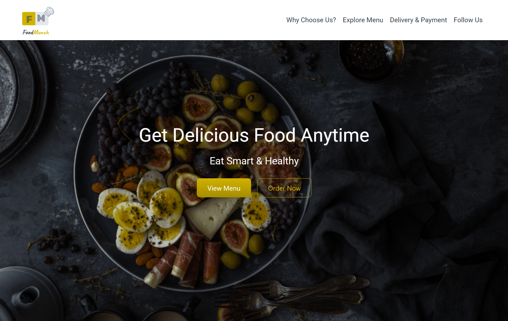
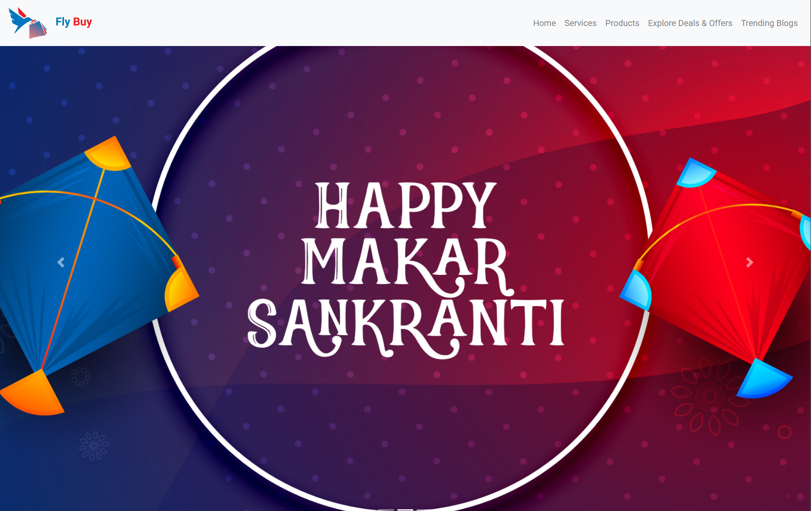

# SHRIHARI PORTFOLIO

<p align="center">
  
</p>

<p align="center">
  <b>A retro-inspired portfolio built with HTML, CSS, and creativity.</b><br>
  Pixel aesthetics • Smooth animations • Case-study driven projects
</p>

<p align="center">
  
  
  
</p>

---

## What is this?

This portfolio was **designed in PowerPoint first** and later transformed into a fully responsive website. It reflects my journey from an **ECE student** to an **aspiring web developer**, combining clean UI, subtle motion, and a playful retro aesthetic.

---

## Featured Sections

* Hero
* About
* Learning Journey — NXTWAVE
* Independent Projects
* Project Case Studies
* Contact

---

## Project Gallery

<table>
<tr>
<td align="center">
  <br>
  <b>Food Munch</b><br>
  Responsive restaurant landing page
</td>
<td align="center">
  <br>
  <b>Fly Buy</b><br>
  E-commerce interface
</td>
</tr>
</table>

---

## Tech Stack

<p align="center">
  
  
  
  
  
</p>

---

## Design Philosophy

* Minimal but expressive
* Pixel-inspired typography
* Soft blue and warm orange palette
* CSS-first animations
* Story-driven project presentation

---

## Upcoming Projects

* SoloTrail
* Weather App
* To-Do App
* Expense Tracker

---

## Run Locally

```bash
git clone https://github.com/Shrihari1705-NBG/Shrihari_Portfolio.git
cd Shrihari_Portfolio
```

Open `index.html` in your browser.

---

## Connect with Me

* LinkedIn: https://www.linkedin.com/in/shrihari-n-b-goudru/
* GitHub: https://github.com/Shrihari1705-NBG

---

<p align="center">
  <b>Designed and developed by Shrihari N B Goudru</b><br>
  <i>Built with curiosity, consistency, and a love for clean interfaces.</i>
</p>
